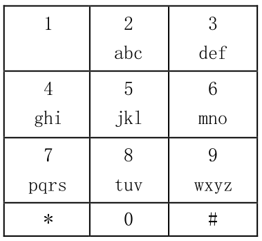

# 发短信

## 题目背景

Nicolas 新买了一个诺基亚手机，他想用这个手机给女神发短信，但他用不来九键键盘，请你帮帮他。
这是一个诺基亚手机的按键面板。

该图像显示按键上可以获得的字母的键。例如，如果我们要获取字母‘a’，我们将按“2”键一次，如果我们想要字母‘b’，我们将按“2”键两次。如果想要获取字母‘z’，我们要按“9”键4次。
另外，如果我们想从同一个键连续写两个不同的字母，我们必须按‘#’间隔。例如，我们要写字符串“klor”，我们将要按键的顺序如下：“55#555666777”。
Nicolas将把他要发送的短信内容告诉你，请你告诉他该如何按键。

## 输入格式

输入一个字符串 S，由英文小写字母组成。

## 输出格式

输出共一行，一个字符串，即你需要按键的顺序。

## 输入样例

klor

## 输出样例

55#555666777

## 数据规模

对于 100%的数据：1 ≤ len(S) ≤ 10000；
